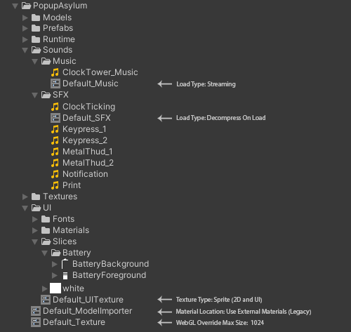

# Importer Presets

A tool to apply a Preset as an asset is imported, this can be useful when a folder is only going to contain Sprites and you want the Texture Importer to be automatically set to "Sprite (2D and UI)".

It can be applied to any Importer that can be made into a Preset, you might for example have a default Preset for models, textures and audio at the root of the 'Assets' folder that you use in all projects to setup the model's material mode and animation compression, iOS overrides on the texture and audio compression,then specialized default Presets set up in child folders to handle specific cases like UI textures and music.

##### Example Project Folder


## Conventions

Presets to be applied during asset import should have names prefixed with "Default_" and use the ".preset" file extension.

Presets are prioritized by folder heirarchy, for an asset to be affected by a Preset it should be in the same folder as the asset or a parent folder.

In order to keep hand made importer changes Presets are only applied the first time an asset is imported. Reapplying the preset on a folder is best done using the Preset's functionality.

## Installation

Installation via the Unity Package Manager.

### OpenUPM

1. In Unity on the top toolbar, go to `Edit > Project Settings > Package Manager`.
2. Add a new Scoped Registry (or edit the existing OpenUPM entry)
```txt
Name        package.openupm.com
URL         https://package.openupm.com
Scope(s)    com.popupasylum.importerpresets
```
3. Click Save (or Apply)
4. Open `Window > Package Manager`
5. Next to the `+` icon, select `My Registries`
6. Select `Importer Presets` and click install on the bottom right.

### Git

1. In Unity on the top toolbar, go to `Window > Package Manager`.
2. Click the `+` icon and select `Add package from Git URL`.
3. Enter the Git URL of this repository `https://github.com/markeahogan/importerpresets.git`.